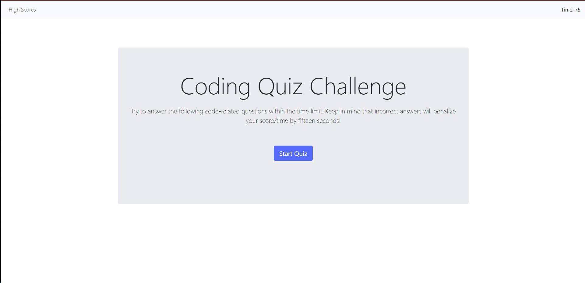
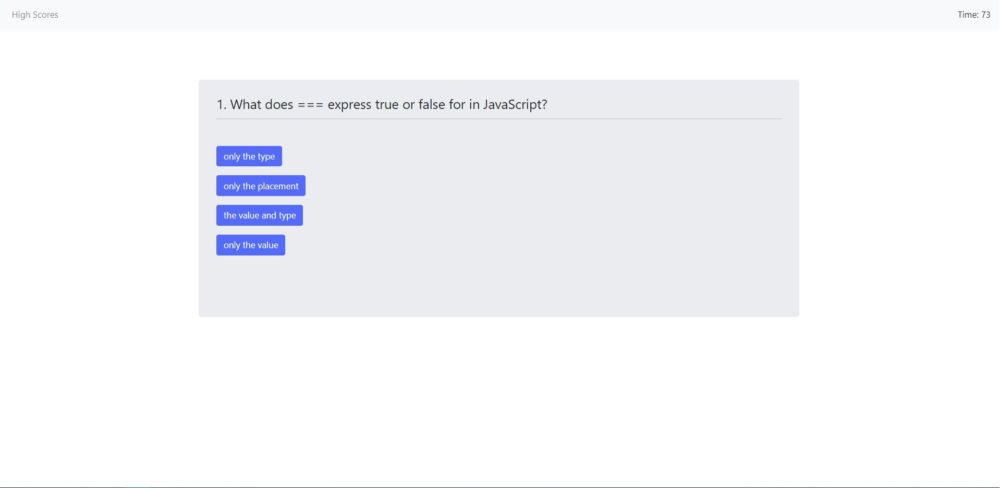
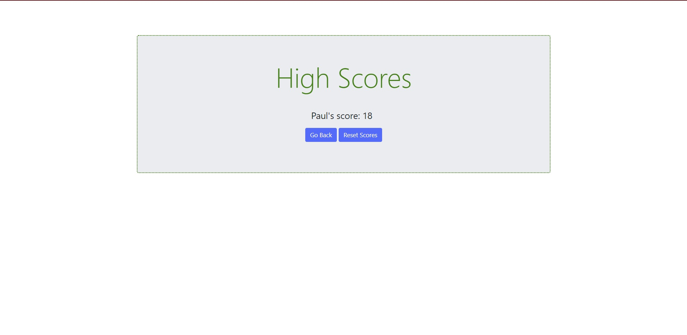

# Coding-Trivia-Game-

[Coding Trivia Game ](https://ewager1.github.io/Coding-Trivia-Game-/)

## Goal

To create a timed quiz utilizing JavaScript fundamentals with the following criteria:

- When start button is clicked, user is presented with a series of question
- Question correctness is tracked and wrong answers result in time being subtracted from a timer
- When all questions are answered or the timer equals 0, the game ends
- When the game ends, the user can save their name with their score

## Positives:

1. Project achieves each of the pre-requisites.
2. I'm happy with the styling and was able to play with my first animations, music, and sound effects.
3. I learned a lot about local storage, manipulating HTML in JS, and enjoyed figuring out the logic.

## Challenges and room for improvment:

1. Continuity: I learned on the go, which means this whole project is not written nearly as concisely as I would like it to be. I wish I had time to
   recreate the project utilizing JQuery better, but only just started grasping it. Still, I'm sure with more time I could make this a lot cleaner.
2. Organizing High Scores: I spent an entire day trying to logically organize my local storage. I tried quite a few methods, but at the moment,  
   writing or implementing a sorting algorithm is a little beyond my ability without simply "stealing" the answer. It's on my growing "learn to do" list.
3. Separation of Concerns: Looking back, it was really cool to write CSS in JS. However, I find it more challenging to find styles since they are  
   currently split between JS and CSS. In the future, I plan to organize most, if not all, style changes in CSS, then toggle classes in JS. This was another part of learning on the go.
